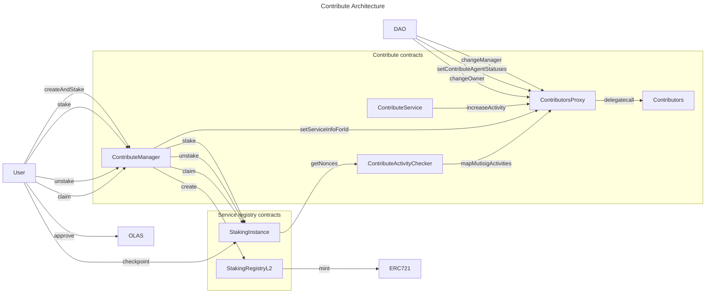

# Autonolas Staking Programmes

## Introduction
This repository contains the Autonolas Staking Programmes set of contracts. It is built on top of a core service staking
functionality of [autonolas-registries](https://github.com/valory-xyz/autonolas-registries).

## Development

### Prerequisites
- This repository follows the standard [`Hardhat`](https://hardhat.org/tutorial/) development process.
- The code is written starting from Solidity `0.8.21`.
- The standard versions of Node.js along with Yarn are required to proceed further (confirmed to work with Yarn `1.22.19` and npx/npm `10.1.0` and node `v18.17.0`).

### Install the dependencies
The project has submodules to get the dependencies. Make sure you run `git clone --recursive` or init the submodules yourself.
The dependency list is managed by the `package.json` file, and the setup parameters are stored in the `hardhat.config.js` file.
Simply run the following command to install the project:
```
yarn install
```

### Core components
The contracts, deployment scripts and tests are located in the following folders respectively:
```
contracts
scripts
test
```

### Compile the code and run
Compile the code:
```
npx hardhat compile
```
Run the tests:
```
npx hardhat test
```
Run tests with forge:
```
forge test --hh -vvv
```


### Linters
- [`ESLint`](https://eslint.org) is used for JS code.
- [`solhint`](https://github.com/protofire/solhint) is used for Solidity linting.


### Github Workflows
The PR process is managed by github workflows, where the code undergoes several steps in order to be verified.
Those include:
- code installation
- running linters
- running tests

## Deployment
The list of contract addresses for different networks and corresponding staking program configurations can be found in JSON files here:
[contracts](https://github.com/valory-xyz/autonolas-staking-programmes/blob/main/scripts/deployment).

The deployment of contracts to the test- and main-net is split into step-by-step series of scripts for more control and checkpoint convenience.
The description of deployment procedure can be found here: [deployment](https://github.com/valory-xyz/autonolas-staking-programmes/blob/main/scripts/deployment).

The finalized contract ABIs for deployment and their number of optimization passes are located here: [ABIs](https://github.com/valory-xyz/autonolas-staking-programmes/blob/main/abis).
Each folder there contains contracts compiled with the solidity version before their deployment.

### Audits
The audit is provided as development matures. The latest audit report can be found here: [audits](https://github.com/valory-xyz/autonolas-staking-programmes/blob/main/audits).

### Related UI to facilitate staking contract creation
- Create staking proxy instance on [Launch](https://launch.olas.network/);
- Vote for staking contracts on [Govern](https://govern.olas.network/).

## Contribute Architecture


## Acknowledgements
The staking programmes contracts were inspired and based on the following sources:
- [Rari-Capital Solmate](https://github.com/Rari-Capital/solmate).
- [Autonolas Registries](https://github.com/valory-xyz/autonolas-registries).
- [Gnosis Mech](https://github.com/gnosis/mech).
- [Safe Ecosystem Safe Contracts](https://github.com/safe-global/safe-contracts).